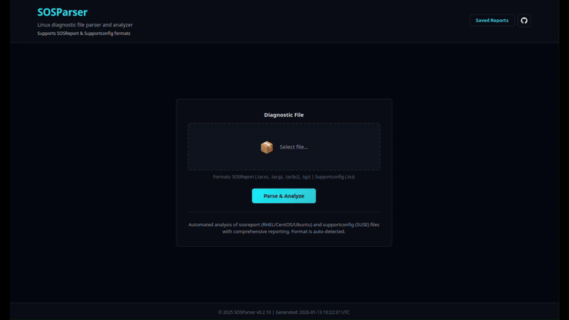

# SOSParser

A web application for automated analysis of Linux sosreport/supportconfig diagnostic files.

[](https://hub.docker.com/r/samuelmatildes/sosparser)
[](https://hub.docker.com/r/samuelmatildes/sosparser)

Join our Telegram group for updates: 

[](https://t.me/+DUy2LLY1-0M1NzI8)



## How to run

### Docker (Recommended)

The easiest way to run SOSParser is using Docker:

```bash
docker pull samuelmatildes/sosparser:latest
docker run -d -p 8000:8000 --name sosparser samuelmatildes/sosparser:latest
```

Then open http://localhost:8000 in your browser.

#### Persisting uploads and reports
- Bind mounts (recommended):
  ```bash
  docker run -d -p 8000:8000 --name sosparser \
    -v $(pwd)/data/uploads:/app/webapp/uploads \
    -v $(pwd)/data/outputs:/app/webapp/outputs \
    samuelmatildes/sosparser:latest
  ```
  Reports live in `/app/webapp/outputs/<token>/report.html` and stay on disk.
- Named volumes:
  ```bash
  docker run -d -p 8000:8000 --name sosparser \
    -v sosparser_uploads:/app/webapp/uploads \
    -v sosparser_outputs:/app/webapp/outputs \
    samuelmatildes/sosparser:latest
  ```
- If you do **not** specify mounts, Docker will create anonymous volumes (due to `VOLUME` in the image); data persists for that container, but new containers won’t reuse it unless you reattach the volume ID.


#### Public Mode (No Data Retention)

For public-facing deployments where you don't want to store any user data, enable **Public Mode**:

```bash
docker run -d -p 8000:8000 --name sosparser \
  -e PUBLIC_MODE=true \
  samuelmatildes/sosparser:latest
```

In Public Mode:
- Reports are generated once, displayed once, then automatically deleted
- The "Saved Reports" browser is hidden from the UI
- No uploaded files or generated reports are persisted
- Output directory is cleaned on container startup
- **Comprehensive audit logging** is automatically enabled (see below)

This is ideal for demo instances or public services where privacy is a concern.

#### Audit Logging (Public Mode)

When running in Public Mode, SOSParser automatically enables comprehensive **audit logging** to monitor and track all user activities. Audit logs are written to stdout in JSON format and can be easily collected by container logging solutions.

**What is logged:**
- All page access (HTTP requests with IP, User-Agent, method, status)
- File upload events (direct and chunked uploads)
- Report generation (start, completion, failures)
- Report viewing events

**Quick start with audit logging:**

```bash
# Using docker-compose with public mode
docker-compose -f docker-compose.public.yml up -d

# View audit logs in real-time
docker-compose -f docker-compose.public.yml logs -f sosparser-public | grep "AUDIT"

# Export audit logs to a file
docker-compose logs sosparser | grep "AUDIT" > audit.log
```

#### Private Mode (Default)

By default, SOSParser runs in **Private Mode** where reports are saved and can be browsed:

```bash
docker run -d -p 8000:8000 --name sosparser samuelmatildes/sosparser:latest
```

In Private Mode:
- Reports are saved in `/app/webapp/outputs/`
- "Saved Reports" button allows browsing and managing generated reports
- Use volume mounts (see above) to persist data across container restarts

### Update

To update to the latest version of SOSParser:

```bash
# Stop and remove the current container
docker stop sosparser
docker rm sosparser

# Pull the latest image
docker pull samuelmatildes/sosparser:latest

# Start a new container with the same settings
docker run -d -p 8000:8000 --name sosparser samuelmatildes/sosparser:latest

# Or if using docker-compose
docker-compose pull
docker-compose down
docker-compose up -d
```

**Note**: If you're using volume mounts for persistent data, your saved reports will be preserved across updates.

#### Configuring Log Line Limits

By default, SOSParser reads the last **1000 lines** from each log file. You can adjust this via environment variables:

| Variable | Default | Description |
|----------|---------|-------------|
| `LOG_LINES_DEFAULT` | 1000 | Fallback default for all logs |
| `LOG_LINES_PRIMARY` | 1000 | Primary logs (messages, syslog, dmesg, journal, auth) |
| `LOG_LINES_SECONDARY` | 500 | Secondary logs (boot, cron, mail, yum/dnf, audit) |

Example with increased limits:

```bash
docker run -d -p 8000:8000 --name sosparser \
  -e LOG_LINES_PRIMARY=2000 \
  -e LOG_LINES_SECONDARY=1000 \
  samuelmatildes/sosparser:latest
```

> **Note**: For browser performance, we recommend keeping limits under 5000 lines. Higher values may cause slower rendering on older devices.

## Usage

### Web Interface

1. Open `http://localhost:8000` in your browser
2. Select a sosreport tarball file (supports .tar.xz, .tar.gz, .tar.bz2, .tar)
3. Click "Analyze Report"
4. View the generated interactive analysis report.


## Processing Capabilities

SOSParser analyzes comprehensive system information from diagnostic reports. For a detailed breakdown of what is currently processed and what features are planned, see [`checklist.md`](checklist.md).

### Currently Processed
- **System Information**: Hardware, OS, kernel, CPU, memory, disk details
- **System Configuration**: Boot, authentication, services, security, packages
- **Filesystem Analysis**: Mounts, LVM, disk usage, filesystem types
- **Network Analysis**: Interfaces, routing, DNS, firewall, connectivity
- **Log Analysis**: System logs, kernel logs, authentication logs, service logs
- **Cloud Services**: AWS, Azure, GCP, Oracle Cloud detection and analysis

### Planned Features
- Advanced disk diagnostics (SMART, ATA)
- Application server configurations (Apache, Nginx, databases)
- Container orchestration (Kubernetes, Docker Swarm)
- Backup and monitoring solutions
- And many more (see [checklist.md](checklist.md) for complete details)


### Build Docker Image Locally

```bash
git clone <your-repo-url>
cd sosparser
docker build -t sosparser:local .
docker run -d -p 8000:8000 sosparser:local
```

### Or use the build script

```bash
./docker-build.sh
```

## Docker Hub

Official Docker image: [samuelmatildes/sosparser](https://hub.docker.com/r/samuelmatildes/sosparser)

Available tags:
- `latest` - Latest stable release from main branch
- `v*.*.*` - Specific version releases
- Multi-platform support: `linux/amd64`, `linux/arm64`

## Contributing

We welcome contributions to `sosparser`! To help us maintain a high-quality codebase, please review and follow these guidelines:

### How to Contribute

1. **Fork the repository**  
   Click "Fork" at the top right of this page and clone your fork locally.

2. **Create a new branch**  
   Branch names should be descriptive, e.g. `feature/add-parsing-support` or `fix/crash-on-upload`.

3. **Make your changes**  
   Please keep your changes focused and avoid unrelated formatting edits.

4. **Write clear commit messages**  
   Describe what your change does and why it’s needed.

5. **Test your changes**  
   Ensure that existing tests pass and write new tests for your features or bugfixes if possible.

6. **Submit a Pull Request**  
   Push your branch and open a Pull Request (PR) to the `main` branch. Include:
   - A summary of your changes
   - Any relevant issue numbers (e.g. `Closes #12`)
   - Screenshots or logs if relevant

7. **Code Review**  
   Be responsive to feedback and please update your PR as requested.


---

## Reporting Issues

If you encounter bugs, have questions, or want to suggest an enhancement:

1. **Search first**  
   Check [existing issues](https://github.com/samatild/sosparser/issues) to avoid duplicates.

2. **Open a new issue**  
   Use the [Issue Tracker](https://github.com/samatild/sosparser/issues/new/choose). Include:
   - A clear and descriptive title
   - Steps to reproduce the problem (if applicable)
   - Expected and actual behavior
   - Environment details (OS, browser, Docker tag, etc.)
   - Screenshots or logs if helpful

3. **Feature Requests**
   Clearly describe the use case and the benefit for others.


Thank you for helping improve `sosparser`!
